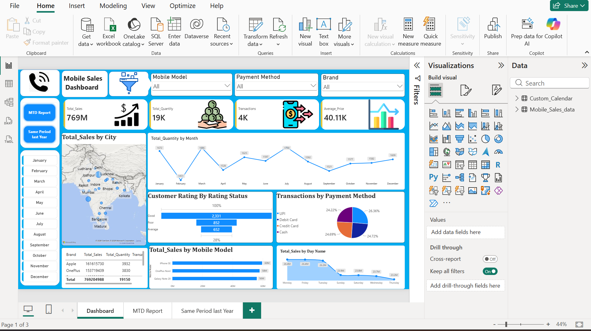
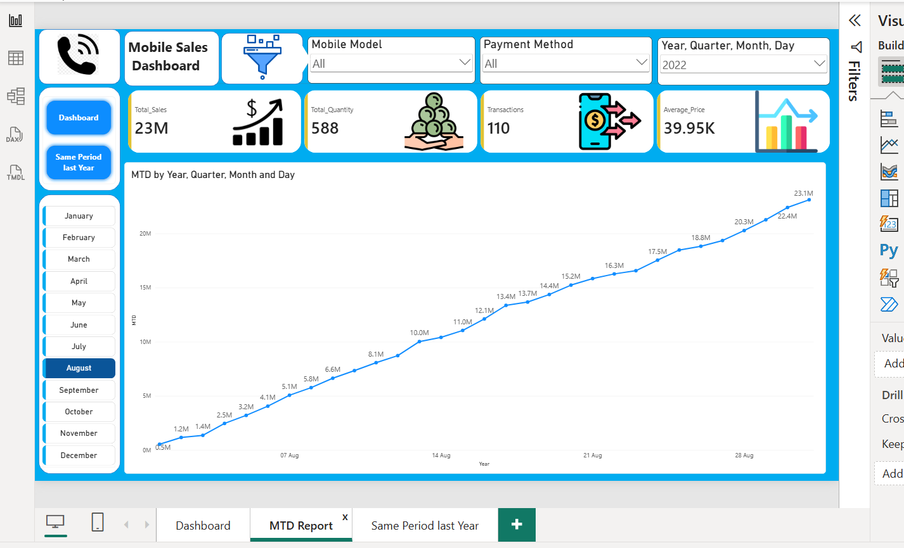
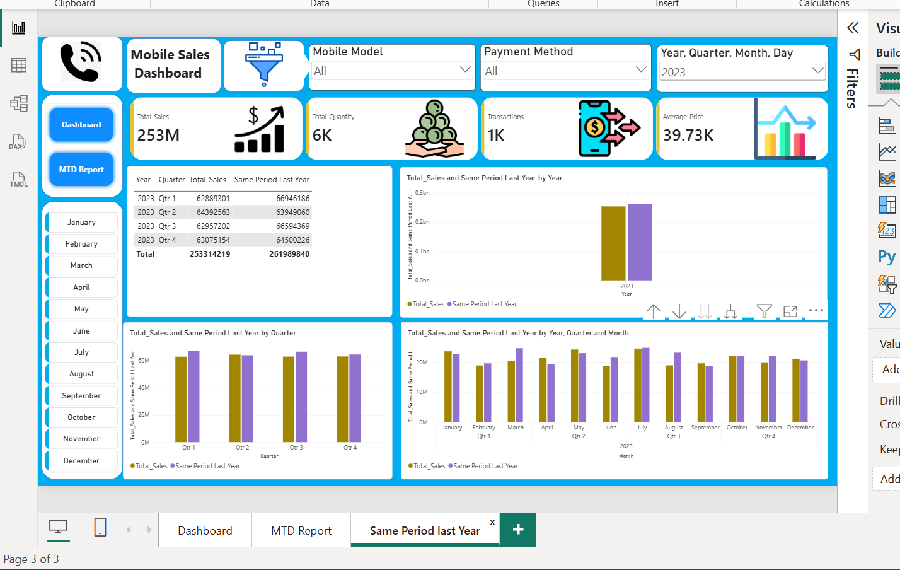

# Mobile Sales Power BI Dashboard

An interactive Power BI dashboard for analyzing mobile sales performance, transactions, customer ratings, payment methods, mobile models, and year-over-year sales trends.

## Dashboard Pages

### 1. Sales Dashboard

Provides an overview of:

- Total Sales
- Total Quantity
- Total Transactions
- Average Price
- Sales by City
- Quantity by Month
- Customer Rating
- Transactions by Payment Method
- Sales by Mobile Model
- Sales by Day
- Brand-level performance

### 2. MTD Report

Provides month-to-date sales analysis with:

- MTD Sales
- MTD Quantity
- MTD Transactions
- Average Price
- Daily MTD sales trend
- Interactive month and year filtering

### 3. Same Period Last Year

Compares current-period performance with the corresponding period from the previous year.

- Sales vs Same Period Last Year
- Quarterly comparison
- Monthly comparison
- Year-over-year performance analysis

## Key Features

- Interactive slicers and filters
- KPI cards
- Time-based sales analysis
- Year-over-year comparison
- City, brand, model, and payment-method analysis
- Interactive visual reporting

## Technical Implementation

- Data transformation using **Power Query**
- Data modeling in **Power BI**
- **DAX** measures for KPI and time-intelligence calculations
- Interactive dashboard design
- Sales and performance analysis

## Tools

**Power BI | Power Query | DAX**
